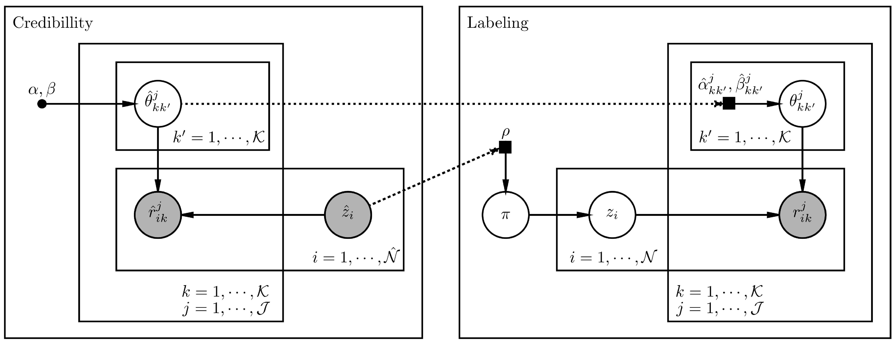

# A Full Probabilistic Model for Yes/No Type Crowdsourcing in Multi-Class Classification

The resources in this repository are part of the proposed model and experiments described in "A Full Probabilistic Model for Yes/No Type Crowdsourcing in Multi-Class Classification" (https://arxiv.org/abs/1901.00397).

## Abstract

Crowdsourcing has become widely used in supervised scenarios where training sets are scarce and difficult to obtain. Most crowdsourcing models in the literature assume labelers can provide answers to full questions. In classification contexts, full questions require a labeler to discern among all possible classes. Unfortunately, discernment is not always easy in realistic scenarios. Labelers may not be experts in differentiating all classes. In this work, we provide a full probabilistic model for a shorter type of queries. Our shorter queries only require "yes" or "no" responses. Our model estimates a joint posterior distribution of matrices related to labelers' confusions and the posterior probability of the class of every object. We developed an approximate inference approach, using Monte Carlo Sampling and Black Box Variational Inference, which provides the derivation of the necessary gradients. We built two realistic crowdsourcing scenarios to test our model. The first scenario queries for irregular astronomical time-series. The second scenario relies on the image classification of animals. We achieved results that are comparable with those of full query crowdsourcing. Furthermore, we show that modeling labelers' failures plays an important role in estimating true classes. Finally, we provide the community with two real datasets obtained from our crowdsourcing experiments. All our code is publicly available.

## Proposed model and inference scheme

Consider a dataset with N objects; each object Xi has only one true class zi, among K possible classes, where i ∈ {1,...,N} and Z = {z1,...,zi,...,zN}. Each labeler Lj is then presented with a series of binary "yes" or "no" (YN) questions, where j ∈ {1, ..., J }. 
Formally, we define a YN question kij as the question asked to labeler Lj about whether Xi belongs ("yes" or "no") to the class Mk, k ∈ {1,...,K}. We define Kij as the set of kij queries asked to labeler Lj for the object Xi. Let rj be the response (or vote) assigned by Lj to ik the question kj, and R the set of all responses rik,j. Note that a labeler is not asked twice for the same class for the same object. 

We propose a probabilistic graphical model (right side of the figure above) to infer the true labels Z. The Labeling area represents the joint distribution of Z and the other variables involved in their prediction. 

We separated the inference into two intuitive stages: first, to estimate the labelers’ reliability by asking them for known objects Nˆ (training set), and second to ask them for unknown objects labels. We could unify these stages in a single inference model with an identical result. In the scenario where Zˆ are observed values, the model estimates beforehand Θˆ and converges faster.

## Data

As describe in the paper, we set up two experiments: 1) labeling irregular time-series of the Catalina Surveys; 2) labeling animals.

In each folder, *catalina* and *animals* (respectively to experiments 1) and 2)), you can find four files:
- `objects.csv`: contains each object presented to the labelers, along with some features that we used to inform the users (not all of them where shown, but we make all data available). In addition, the last four variables: `Var_Type`, `_training`, `_validation`, `_abc`, indicate the ground truth, whether the objects are part of the prior credibilities training process, used for test or validations, plus a variable that indicates whether the object was also used to ask ABCD questions to the labelers, respectively.
    
- `users.csv`: indicates how many questions were randomly assigned to each user when they enrolled the labeling task - note that not all users annotated all objects; hence, we worked with the ones that completed at least 70\% of the task.
    
- `votes_abcd.cs`
    
- `votes_yn.cs`
    

## Implementation details and usage

#### 00. PYMC | BBVI - Bayesian YN question type
A documented implementation of the proposed model and some tests/results in its two versions: using PYMC3 and BBVI. All implemented equations are referenced to the paper (and supplementary material) equations numbers. The supplementary material provides the derivation of the needed gradients to solve the model, which can be easily extended to any model with similar variable types, and you can find these derivations implemented in this notebook.

#### 01. PYMC - Bayesian ABCD question type
A documented implementation and some tests/results of the baseline model.

## Acknowledgements

Our work was supported in part by the CSS survey, which is funded by the National Aeronautics and Space Administration under Grant No. NNG05GF22G issued through the Science Mission Directorate Near-Earth Objects Observations Program. We would also like to thank the anonymous reviewers whose comments greatly improved this manuscript. 
